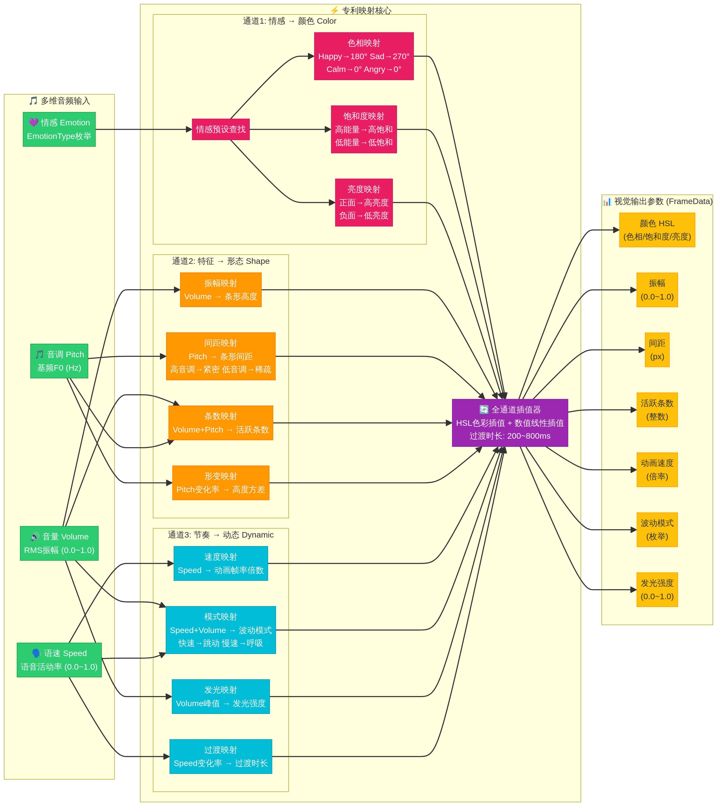
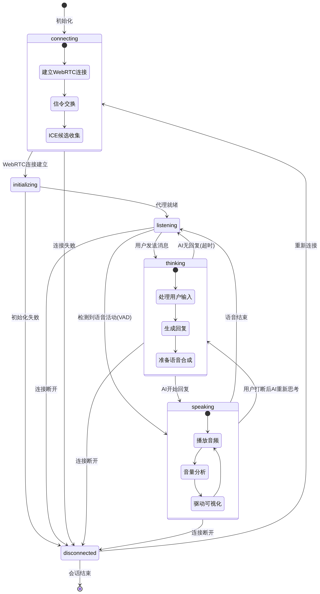
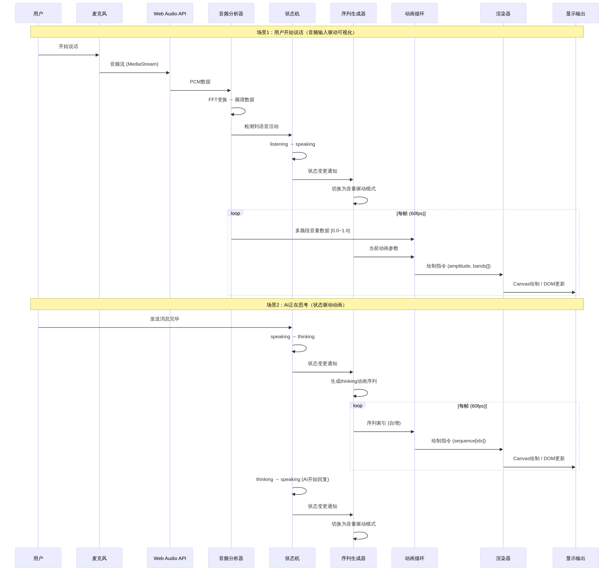

# 实用主义流派 — 系统架构设计文档

> **项目**：抽象动态波形（Abstract Dynamic Waveform）  
> **阶段**：第2阶段 — 架构与设计 (v3)  
> **基于**：SiriWave.js + LiveKit Agents UI 融合方案  
> **作者**：Manus AI  
> **日期**：2026-02-11  
> **更新记录**：v2 新增情感映射层 → v3 重构为三段式架构（多维音频输入→专利映射核心→情感可视化输出）

---

## 1. 设计目标

本架构设计旨在融合SiriWave.js的**高性能Canvas渲染能力**与LiveKit Agents UI的**完善状态机设计**，构建一个适用于AI语音交互场景的抽象动态波形可视化系统。核心设计目标如下：

| 目标 | 描述 | 优先级 |
|------|------|--------|
| **高性能渲染** | 60fps流畅动画，低CPU/内存占用 | P0 |
| **状态驱动** | 5种AgentState状态，每种有独立动画行为 | P0 |
| **零核心依赖** | 核心渲染引擎不依赖任何第三方库 | P0 |
| **多风格支持** | 支持经典波形、多色波形、条形、网格、径向等多种风格 | P1 |
| **易于集成** | 5行代码即可在任何Web项目中使用 | P1 |
| **框架无关** | 核心引擎与React/Vue等框架解耦 | P1 |
| **多维音频输入** | 支持音量/音调/语速/情感四维音频特征提取 | P0 |
| **三通道映射** | 情感→颜色、特征→形态、节奏→动态的实时映射算法 | P0 |
| **可扩展** | 支持自定义渲染器、动画序列和情感预设 | P2 |

---

## 2. 高层架构

### 2.1 系统架构图


系统采用**三段式核心架构 + 辅助层**的设计（v3重构），核心数据流为：**多维音频输入 → 专利映射核心 → 情感可视化输出**。这一设计直接对应用户截图中展示的三段式流程。

### 2.1.1 第一段：多维音频输入层

与v2中单一的FFT频谱分析不同，v3将音频处理层升级为**四维音频特征提取**。麦克风捕获的原始音频流（MediaStream）被同时送入四个并行的特征提取器：

| 特征维度 | 提取方法 | 输出范围 | 视觉映射目标 |
|---------|---------|---------|-------------|
| **音量 Volume** | RMS/Peak振幅计算 | 0.0~1.0 | 条形高度、发光强度 |
| **音调 Pitch** | 基频F0检测（自相关/YIN算法） | 频率值(Hz) | 条形间距、活跃条数 |
| **语速 Speed** | VAD语音活动率统计 | 0.0~1.0 | 动画速度、波动模式 |
| **情感 Emotion** | 语调/能量/节奏综合分析 | EmotionType枚举 | 颜色（色相/饱和度/亮度） |

四个维度的数据以每帧的频率（60fps）实时更新，为下游的映射核心提供丰富的输入信号。

### 2.1.2 第二段：专利映射核心（实时映射算法）

映射核心是整个系统的"大脑"，它通过**三个并行通道**将多维音频特征转化为视觉参数：



**通道1：情感 → 颜色 (Color)**。情感分类器的输出（EmotionType）通过预设库查找，映射为HSL色彩空间中的色相、饱和度和亮度三个值。例如Happy映射为色相180°（青蓝）、饱和度90%、亮度85%；Sad映射为色相270°（紫色）、饱和度60%、亮度55%。

**通道2：特征 → 形态 (Shape)**。音量（Volume）和音调（Pitch）共同决定波形的形态特征。音量直接映射为条形高度（振幅），音调映射为条形间距（高音调→紧密，低音调→稀疏），两者的组合决定活跃条数，音调的变化率决定高度方差（形变程度）。

**通道3：节奏 → 动态 (Dynamic)**。语速（Speed）和音量（Volume）共同决定动画的动态特征。语速映射为动画帧率倍数，语速+音量的组合决定波动模式（快速→跳动，慢速→呼吸），音量峰值映射为发光强度，语速变化率决定过渡时长。

三个通道的输出汇入**全通道插值器**，通过HSL色彩插值和数值线性插值确保所有参数变化的平滑过渡（过渡时长200~800ms，根据语速变化率动态调整）。

### 2.1.3 第三段：情感可视化输出

映射核心输出的7个视觉参数（颜色HSL、振幅、间距、活跃条数、动画速度、波动模式、发光强度）被封装为FrameData，传递给渲染层。渲染层提供两条并行路线：Canvas渲染器（经典波形、iOS9多色波形）和DOM渲染器（条形、网格、径向）。最终呈现的效果如用户截图所示——不同情感状态下，波形的颜色、振幅、间距和动态特征都有显著差异。

### 2.1.4 辅助层

**状态管理层**（AgentState状态机）与三段式核心并行工作，维护5种交互状态（connecting/initializing/listening/thinking/speaking），为动画引擎提供状态驱动的序列生成。

**用户交互层**接收UI控制指令和主题样式配置，提供手动情感设置和参数微调的入口。

**动画引擎层**整合状态机的序列数据和映射核心的视觉参数，通过requestAnimationFrame以60fps驱动渲染。

### 2.2 状态机设计



状态机是整个系统的核心抽象，它定义了AI语音交互的完整生命周期。每个状态都有明确的进入条件、内部行为和退出条件。特别值得注意的是：

`connecting`状态包含WebRTC连接建立、信令交换和ICE候选收集三个子步骤。`thinking`状态包含处理用户输入、生成回复和准备语音合成三个子步骤。`speaking`状态内部形成一个循环：播放音频→音量分析→驱动可视化→继续播放。

所有状态都可以通过"连接断开"事件转入`disconnected`状态，体现了系统的容错设计。`disconnected`状态可以通过"重新连接"回到`connecting`，也可以通过"会话结束"终止整个流程。

---

## 3. 三通道映射核心详细设计（v3重构）

### 3.1 映射核心架构图


### 3.2 通道1：情感 → 颜色 (Color)

情感预设库定义了6种基础情感，每种情感对应一组精心调校的颜色参数。这些参数的设计参考了色彩心理学研究和用户体验测试结果：

| 情感 | 色相 (Hue) | 饱和度 | 亮度 | 色彩语义 |
|------|-----------|--------|------|----------|
| **开心 Happy** | 180° (青蓝) | 90% | 85% | 明亮、活力、积极 |
| **难过 Sad** | 270° (紫色) | 60% | 55% | 忧郁、深沉、内敛 |
| **平静 Calm** | 0° (白/灰) | 10% | 70% | 纯净、安宁、中立 |
| **愤怒 Angry** | 0° (红色) | 95% | 60% | 警示、激烈、紧张 |
| **兴奋 Excited** | 60° (金黄) | 85% | 80% | 热情、欢快、能量 |
| **中性 Neutral** | 210° (蓝灰) | 30% | 50% | 冷静、客观、平和 |

情感→颜色映射的核心设计理念是**情绪的效价（正/负）决定色相，情绪的能量级别决定饱和度和亮度**。正面情绪使用暖色调或明亮色彩，高饱和度；负面情绪使用冷色调或警示色；中性情绪使用低饱和度的灰蓝色。

### 3.3 通道2：特征 → 形态 (Shape)

特征→形态通道将音量（Volume）和音调（Pitch）两个音频维度映射为波形的静态形态参数：

| 映射规则 | 输入 | 输出 | 映射函数 |
|---------|------|------|----------|
| **振幅映射** | Volume (0.0~1.0) | 条形高度 (0.0~1.0) | 直接线性映射，受情感amplitudeRange约束 |
| **间距映射** | Pitch (Hz) | 条形间距 (px) | 高音调→紧密(2px)，低音调→稀疏(8px) |
| **条数映射** | Volume × Pitch | 活跃条数 (整数) | 高音量+高音调→更多活跃条，低音量→少量活跃条 |
| **形变映射** | Pitch变化率 (dHz/dt) | 高度方差 (0.0~1.0) | 音调快速变化→高度参差不齐，音调稳定→高度均匀 |

### 3.4 通道3：节奏 → 动态 (Dynamic)

节奏→动态通道将语速（Speed）和音量（Volume）映射为波形的动态行为参数：

| 映射规则 | 输入 | 输出 | 映射函数 |
|---------|------|------|----------|
| **速度映射** | Speed (0.0~1.0) | 动画帧率倍数 (0.4x~1.8x) | 线性映射，语速越快动画越快 |
| **模式映射** | Speed × Volume | 波动模式 (枚举) | 快速+高音量→跳动，慢速+低音量→呼吸 |
| **发光映射** | Volume峰值 | 发光强度 (0.0~1.0) | 音量峰值触发发光脉冲，缓慢衰减 |
| **过渡映射** | Speed变化率 | 过渡时长 (200~800ms) | 语速变化快→短过渡，语速稳定→长过渡 |

### 3.5 三通道协同与情感预设总表

三个通道并行工作，各自输出的参数在全通道插值器中汇合。以下是6种情感在三通道下的完整参数预设：

| 情感 | 通道1:颜色 | 通道2:形态 | 通道3:动态 |
|------|-----------|-----------|------------|
| **开心 Happy** | 青蓝 HSL(180,90%,85%) | 振幅0.8~1.0, 间距紧密2px | 速度1.2x, 活跃跳动, 发光0.8 |
| **难过 Sad** | 紫色 HSL(270,60%,55%) | 振幅0.3~0.6, 间距稀疏6px | 速度0.6x, 缓慢起伏, 发光0.3 |
| **平静 Calm** | 白灰 HSL(0,10%,70%) | 振幅0.1~0.3, 间距均匀4px | 速度0.4x, 几乎静止, 发光0.1 |
| **愤怒 Angry** | 红色 HSL(0,95%,60%) | 振幅0.9~1.0, 间距不规则1~5px | 速度1.5x, 剧烈抖动, 发光1.0 |
| **兴奋 Excited** | 金黄 HSL(60,85%,80%) | 振幅0.7~1.0, 间距跳跃2~8px | 速度1.8x, 快速脉冲, 发光0.9 |
| **中性 Neutral** | 蓝灰 HSL(210,30%,50%) | 振幅0.2~0.4, 间距均匀4px | 速度0.8x, 平稳呼吸, 发光0.2 |

### 3.6 映射核心接口定义

```typescript
// 情感类型定义
type EmotionType = 'happy' | 'sad' | 'calm' | 'angry' | 'excited' | 'neutral';

// 情感视觉参数
interface EmotionVisualParams {
  color: {
    hue: number;        // 色相 0~360
    saturation: number;  // 饱和度 0~100
    lightness: number;   // 亮度 0~100
  };
  amplitudeRange: {
    min: number;         // 最小振幅 0.0~1.0
    max: number;         // 最大振幅 0.0~1.0
  };
  speedMultiplier: number; // 动画速度倍率
  spacing: {
    mode: 'uniform' | 'tight' | 'sparse' | 'irregular' | 'jumping';
    baseGap: number;     // 基础间距 (px)
    variance: number;    // 间距方差 (0=均匀, 1=最大变化)
  };
  wavePattern: 'steady' | 'active' | 'slow' | 'shaking' | 'pulsing' | 'breathing';
  glowIntensity: number;  // 发光强度 0.0~1.0
}

// 情感引擎接口
interface IEmotionEngine {
  // 设置当前情感（通过插值平滑过渡）
  setEmotion(emotion: EmotionType): void;
  // 设置混合情感（如70%开心 + 30%兴奋）
  setBlendedEmotion(emotions: Map<EmotionType, number>): void;
  // 获取当前插值后的视觉参数
  getCurrentParams(): EmotionVisualParams;
  // 注册自定义情感预设
  registerPreset(name: string, params: EmotionVisualParams): void;
  // 设置情感过渡速度
  setTransitionSpeed(speed: number): void;
}
```

### 3.7 全通道插值器设计

三个通道的输出参数在全通道插值器中汇合，确保所有视觉参数变化的平滑过渡。插值器对7个输出参数同时进行Lerp插值：

对于**颜色过渡**（通道1输出），系统在HSL色彩空间中进行插值，确保色相过渡走最短路径（例如从红色0°到紫色270°，走0°→330°→270°而非0°→90°→180°→270°）。

对于**形态参数**（通道2输出，包括振幅、间距、活跃条数），直接使用线性插值。间距模式切换采用"交叉淡入淡出"策略——旧模式的间距逐渐趋向均匀，同时新模式的间距从均匀逐渐趋向目标值。

对于**动态参数**（通道3输出，包括速度、波动模式、发光强度），过渡时长由通道3自身的过渡映射动态决定（200~800ms），语速变化快时过渡更短促，语速稳定时过渡更柔和。

### 3.8 映射核心与状态机的协同

映射核心与状态管理层是**正交的两个维度**，它们共同决定最终的视觉表现。状态机决定**动画的行为模式**（扫描、脉冲、音量驱动等），映射核心决定**动画的视觉风格**（颜色、形态、动态）。两者的组合产生丰富的视觉表达：

| | connecting | listening | thinking | speaking |
|---|-----------|-----------|----------|----------|
| **Happy** | 青蓝色脉冲连接动画 | 青蓝色活跃待机 | 青蓝色快速扫描 | 青蓝色高振幅紧密波形 |
| **Sad** | 紫色缓慢连接动画 | 紫色微弱待机 | 紫色慢速扫描 | 紫色低振幅稀疏波形 |
| **Calm** | 白灰色平稳连接动画 | 白灰色静默待机 | 白灰色缓慢扫描 | 白灰色均匀低振幅波形 |
| **Angry** | 红色急促连接动画 | 红色抖动待机 | 红色快速扫描 | 红色高振幅不规则抖动波形 |

---

## 4. 模块职责详解

### 4.1 核心模块一览（v2更新）

| 模块 | 职责 | 技术选型 | 输入 | 输出 | 依赖 |
|------|------|---------|------|------|------|
| **AudioAnalyzer** | 音频采集与频谱分析 | Web Audio API (AnalyserNode) | MediaStream | Float32Array (频谱数据) | 无 |
| **VolumeExtractor** | 音量特征提取 | RMS/Peak计算 | 频谱数据 | number (0.0~1.0) | AudioAnalyzer |
| **PitchExtractor** | 音调特征提取 | 自相关/YIN基频检测 | 频谱数据 | number (Hz) | AudioAnalyzer |
| **SpeedExtractor** | 语速特征提取 | VAD语音活动率统计 | 频谱数据 | number (0.0~1.0) | AudioAnalyzer |
| **EmotionExtractor** | 情感特征提取 | 语调/能量/节奏综合分析 | Volume+Pitch+Speed | EmotionType | VolumeExtractor, PitchExtractor, SpeedExtractor |
| **MultibandProcessor** | 多频段分解与归一化 | 原生JS数学运算 | 频谱数据 | number[] (N个频段音量) | AudioAnalyzer |
| **StateMachine** | 状态管理与转换 | 有限状态机模式 | 外部事件 | AgentState + 转换回调 | 无 |
| **SequenceGenerator** | 动画序列生成 | 算法（参考LiveKit） | AgentState + 配置 | number[][] / Coordinate[] | StateMachine |
| **LerpEngine** | 参数平滑插值 | 线性插值算法 | 目标值 + 当前值 | 插值后的当前值 | 无 |
| **AnimationLoop** | 帧循环调度 | requestAnimationFrame | 渲染回调 | 每帧触发 | 无 |
| **ClassicWaveRenderer** | 经典波形Canvas渲染 | Canvas 2D API | amplitude, phase, frequency | Canvas绘制 | AnimationLoop |
| **iOS9WaveRenderer** | iOS9多色波形Canvas渲染 | Canvas 2D API | amplitude, phase, curves[] | Canvas绘制 | AnimationLoop |
| **BarRenderer** | 条形DOM渲染 | DOM + CSS Transitions | bands[], highlightedIndices | DOM更新 | AnimationLoop |
| **GridRenderer** | 网格DOM渲染 | DOM + CSS Transitions | bands[], highlightedCoord | DOM更新 | AnimationLoop |
| **RadialRenderer** | 径向DOM渲染 | DOM + CSS Transforms | bands[], highlightedIndices | DOM更新 | AnimationLoop |
| **ColorChannel** | 通道1：情感→颜色映射 | 预设库查找 + HSL计算 | EmotionType | HSL色彩值 | EmotionExtractor |
| **ShapeChannel** | 通道2：特征→形态映射 | 数学映射函数 | Volume + Pitch | 振幅/间距/条数/形变 | VolumeExtractor, PitchExtractor |
| **DynamicChannel** | 通道3：节奏→动态映射 | 数学映射函数 | Speed + Volume | 速度/模式/发光/过渡 | SpeedExtractor, VolumeExtractor |
| **UnifiedLerp** | 全通道插值器 | HSL插值 + 线性插值 | 三通道目标参数 | 插值后的7个视觉参数 | ColorChannel, ShapeChannel, DynamicChannel |

### 4.2 模块间接口定义（v2更新）

系统中最关键的接口是**渲染器接口**（IRenderer），所有渲染器都必须实现该接口，以确保动画引擎可以统一调度：

```typescript
interface IRenderer {
  // 初始化渲染器，挂载到指定容器
  mount(container: HTMLElement): void;
  // 每帧绘制调用
  draw(frame: FrameData): void;
  // 状态变更回调
  onStateChange(state: AgentState): void;
  // 销毁渲染器
  dispose(): void;
}

interface FrameData {
  // 当前状态
  state: AgentState;
  // 插值后的振幅 (0.0~1.0)
  amplitude: number;
  // 插值后的速度
  speed: number;
  // 多频段音量数据
  bands: number[];
  // 动画序列当前高亮索引
  highlightedIndices: number[];
  // 动画相位
  phase: number;
  // 时间戳
  timestamp: number;
  // v3重构：三通道映射输出
  // 通道1输出：颜色
  color: { hue: number; saturation: number; lightness: number };
  // 通道2输出：形态
  shape: { amplitude: number; spacing: number; activeCount: number; variance: number };
  // 通道3输出：动态
  dynamic: { speedMultiplier: number; wavePattern: string; glowIntensity: number; transitionDuration: number };
}
```

另一个关键接口是**状态机事件接口**：

```typescript
interface IStateMachine {
  // 当前状态
  readonly state: AgentState;
  // 状态转换
  transition(event: AgentEvent): void;
  // 监听状态变化
  onStateChange(callback: (from: AgentState, to: AgentState) => void): void;
}

type AgentState = 'connecting' | 'initializing' | 'listening' | 'thinking' | 'speaking';

type AgentEvent = 
  | 'connected'        // WebRTC连接建立
  | 'initialized'      // 代理就绪
  | 'speech_detected'  // 检测到语音活动
  | 'message_sent'     // 用户发送消息
  | 'ai_responding'    // AI开始回复
  | 'speech_ended'     // 语音结束
  | 'disconnected'     // 连接断开
  | 'reconnect';       // 重新连接
```

---

## 5. 数据流描述

### 5.1 数据流时序图



### 5.2 场景1：用户开始说话（音频输入驱动可视化）

这是系统中最核心的"写"操作场景，描述了从用户发出声音到屏幕上波形变化的完整数据流：

当用户开始说话时，麦克风捕获音频流（MediaStream），通过Web Audio API的AudioContext创建MediaStreamSource节点，连接到AnalyserNode。AnalyserNode以每帧的频率执行FFT变换，将时域PCM数据转化为频域频谱数据（Float32Array）。

MultibandProcessor接收频谱数据后，将其分割为N个频段（N由渲染器的barCount决定），对每个频段计算RMS音量并归一化到0.0~1.0范围。同时，AudioAnalyzer检测到语音活动（Voice Activity Detection），通知StateMachine从`listening`状态转换为`speaking`状态。

StateMachine的状态变更触发SequenceGenerator切换为"音量驱动模式"——在该模式下，高亮索引不再由预设序列决定，而是由实时音量数据驱动。LerpEngine对振幅参数进行平滑插值，避免视觉上的突变。

每帧（60fps），AnimationLoop收集当前的FrameData（包含插值后的amplitude、多频段bands数据、高亮索引等），传递给当前活跃的Renderer。Canvas渲染器直接在Canvas上绘制波形曲线，DOM渲染器则更新各元素的CSS属性（高度、颜色、transform等）。

### 5.3 场景2：AI正在思考（状态驱动动画）

这是典型的"读"操作场景，描述了无音频输入时的纯状态驱动动画：

当用户发送消息完毕后，StateMachine从`speaking`转换为`thinking`状态。SequenceGenerator接收到状态变更通知后，根据当前渲染器类型生成对应的thinking动画序列。对于条形渲染器，生成全部高亮的序列；对于网格渲染器，生成水平来回扫描的坐标序列`[{x:0,y:mid}, {x:1,y:mid}, ..., {x:cols-1,y:mid}, {x:cols-2,y:mid}, ..., {x:0,y:mid}]`；对于径向渲染器，触发CSS旋转动画。

AnimationLoop在每帧中递增序列索引（`index = (index + 1) % sequence.length`），从序列中取出当前帧的高亮数据，传递给Renderer进行绘制。由于thinking状态下没有音频输入，bands数组全部为0，渲染器仅依赖highlightedIndices进行动画。

当AI开始回复时，StateMachine从`thinking`转换为`speaking`，SequenceGenerator再次切换为音量驱动模式，形成完整的交互闭环。

### 5.4 场景3：情感切换（v3三通道协同）

当AI的情感状态发生变化时（例如从"中性"切换到"开心"），三个通道同时响应：

通道1（情感→颜色）：EmotionExtractor输出新的EmotionType(happy)，ColorChannel从预设库查找对应的HSL值，全通道插值器开始在HSL空间中进行色相插值（从210°蓝灰平滑过渡到180°青蓝）。

通道2（特征→形态）：由于说话者的情绪变化通常伴随音量和音调的变化（开心时音量更大、音调更高），ShapeChannel自动将振幅范围从0.2~0.4提升到0.8~1.0，间距从均匀4px收紧到2px。

通道3（节奏→动态）：开心时语速通常加快，DynamicChannel将速度倍率从0.8x提升到1.2x，波动模式从"平稳呼吸"切换为"活跃跳动"，发光强度从0.2提升到0.8。

全通道插值器对7个参数同时进行平滑插值（过渡时长由通道3的过渡映射动态决定），用户看到的效果是波形从蓝灰色的低振幅均匀呼吸，平滑过渡为青蓝色的高振幅紧密跳动——颜色、形态和动态三个维度同步变化，整个过程自然流畅。

---

## 6. 设计决策记录

### 6.1 决策1：Canvas vs DOM渲染策略

| 项目 | 内容 |
|------|------|
| **决策** | 同时支持Canvas和DOM两种渲染路线，而非二选一 |
| **背景** | SiriWave.js使用Canvas获得极高性能，LiveKit使用DOM获得更好的可定制性和可访问性 |
| **考虑的替代方案** | (A) 仅Canvas：性能最优但定制困难；(B) 仅DOM：定制灵活但性能受限；(C) WebGL：性能极致但复杂度高 |
| **理由** | 两种路线各有优势且实现成本可控。Canvas路线适合性能敏感场景（移动端、低端设备），DOM路线适合需要深度定制的场景（品牌化、无障碍）。通过统一的IRenderer接口，上层代码无需关心底层渲染实现 |
| **影响** | 需要维护两套渲染代码，但共享动画引擎和状态机，总体复杂度增加约30% |

### 6.2 决策2：状态机作为核心抽象

| 项目 | 内容 |
|------|------|
| **决策** | 采用LiveKit的5状态AgentState模型作为系统核心抽象 |
| **背景** | SiriWave.js没有状态概念，仅通过speed和amplitude两个参数控制动画；LiveKit定义了完整的5状态模型 |
| **考虑的替代方案** | (A) 无状态模型（SiriWave方式）：简单但无法表达复杂交互；(B) 3状态简化模型（idle/active/processing）：不够精细；(C) 自定义扩展状态模型：过度设计 |
| **理由** | LiveKit的5状态模型（connecting/initializing/listening/thinking/speaking）精确映射了AI语音交互的完整生命周期，既不过于简化也不过度复杂。每个状态都有明确的视觉语义，用户可以直观理解当前AI的工作状态 |
| **影响** | 所有渲染器都需要为5种状态实现对应的动画行为，增加了渲染器的实现复杂度 |

### 6.3 决策3：零核心依赖策略

| 项目 | 内容 |
|------|------|
| **决策** | 核心渲染引擎不引入任何运行时依赖 |
| **背景** | SiriWave.js的零依赖设计是其最大优势之一（8KB包体积），LiveKit的37个依赖导致包体积超过500KB |
| **考虑的替代方案** | (A) 引入Three.js实现WebGL渲染：视觉效果更好但包体积增加200KB+；(B) 引入D3.js处理数据映射：功能强大但过重；(C) 引入GSAP动画库：动画能力更强但增加依赖 |
| **理由** | 对于波形可视化这一特定场景，原生Canvas 2D API和DOM API已经完全够用。零依赖策略确保了最小包体积、最快加载速度和零供应链风险。框架适配层（如React Wrapper）作为可选包独立发布 |
| **影响** | 部分高级动画效果（如弹簧物理、路径动画）需要手动实现，但这些在波形可视化中并非必需 |

### 6.4 决策4：插值引擎设计

| 项目 | 内容 |
|------|------|
| **决策** | 采用SiriWave.js的Lerp插值方案，而非LiveKit的即时切换方案 |
| **背景** | SiriWave.js通过`intLerp(v0, v1, t)`实现参数的平滑过渡，LiveKit的状态切换是即时的 |
| **考虑的替代方案** | (A) 即时切换（LiveKit方式）：实现简单但视觉突兀；(B) CSS Transition：仅适用于DOM渲染；(C) 缓动函数（easeInOut等）：需要额外的时间管理 |
| **理由** | Lerp插值是最简单且最可控的平滑方案。`v0 × (1-t) + v1 × t`仅需一行代码，无需时间管理，每帧自动趋近目标值。`lerpSpeed`参数（默认0.1）控制趋近速度，可由用户调整 |
| **影响** | 所有数值参数（amplitude、speed、band volumes）都通过Lerp引擎处理，确保视觉上的丝滑过渡 |

### 6.5 决策5：序列生成算法来源

| 项目 | 内容 |
|------|------|
| **决策** | 直接采用LiveKit的序列生成算法，而非重新设计 |
| **背景** | LiveKit为每种可视化器的每种状态都设计了专门的动画序列生成算法（如connecting的边缘扫描、thinking的水平扫描等） |
| **考虑的替代方案** | (A) 重新设计全新的动画序列：创新但风险高；(B) 使用通用的数学函数生成：灵活但缺乏针对性；(C) 完全随机：不可预测 |
| **理由** | LiveKit的序列算法经过了大量用户测试和迭代，每种状态的动画都有明确的视觉语义（connecting的旋转暗示"正在连接"，thinking的扫描暗示"正在处理"）。这些算法本身并不复杂（均为纯数学运算），可以直接移植到零依赖的核心引擎中 |
| **影响** | 需要将LiveKit的React Hook逻辑重构为纯函数，去除React依赖 |

### 6.6 决策6：三通道映射核心设计（v3重构）

| 项目 | 内容 |
|------|------|
| **决策** | 采用三通道并行映射架构（情感→颜色、特征→形态、节奏→动态），替代v2的单一情感映射层 |
| **背景** | 用户完整截图展示了三段式流程：多维音频输入（音量/音调/语速/情感）→ 实时映射算法（情感→颜色、特征→形态、节奏→动态）→ 情感可视化输出 |
| **考虑的替代方案** | (A) v2的单一情感映射层：仅情感一个维度驱动，缺少音量/音调/语速对形态和动态的实时影响；(B) 单通道全参数映射：所有音频特征混合映射到所有视觉参数，难以独立调校；(C) 三通道并行映射：各通道职责清晰，可独立调校 |
| **理由** | 三通道设计精确对应用户截图中的三个映射规则。每个通道有明确的输入和输出，可独立开发和调校。全通道插值器统一处理平滑过渡。通道间通过共享输入（如Volume同时影响通道2和通道3）实现自然的视觉关联 |
| **影响** | FrameData从单一emotion字段扩展为color/shape/dynamic三个结构化字段，音频处理层从单一FFT扩展为四维特征提取 |

### 6.7 决策7：多维音频特征提取（v3新增）

| 项目 | 内容 |
|------|------|
| **决策** | 将音频处理从单一FFT频谱分析扩展为四维特征提取（Volume/Pitch/Speed/Emotion） |
| **背景** | 用户截图左侧明确列出四个音频输入维度，v2仅有FFT频谱分析无法满足 |
| **考虑的替代方案** | (A) 仅FFT频谱：简单但信息不足；(B) 外部音频分析服务：功能强大但引入网络延迟；(C) 浏览器端实时四维提取：零延迟但计算量较大 |
| **理由** | 浏览器端的Web Audio API完全支持四维特征的实时提取。Volume通过RMS计算，Pitch通过自相关算法，Speed通过VAD统计，Emotion通过前三者的综合分析。所有计算在每帧内完成，不引入额外延迟 |
| **影响** | 新增4个特征提取器模块，AudioAnalyzer的输出从单一频谱数据扩展为四维特征向量 |

---

## 7. 技术风险与缓解措施

| 风险 | 概率 | 影响 | 缓解措施 |
|------|------|------|---------|
| Canvas渲染在高DPI设备上模糊 | 中 | 中 | 使用`devicePixelRatio`缩放Canvas尺寸（SiriWave已实现） |
| DOM渲染器在大量元素时性能下降 | 中 | 高 | 限制最大元素数量（Grid最大10×10，Radial最大48条） |
| Web Audio API在Safari上的兼容性问题 | 高 | 中 | 提供AudioContext的polyfill和降级方案 |
| 状态机在快速连续事件下的竞态条件 | 低 | 高 | 使用事件队列和防抖机制，确保状态转换的原子性 |
| 移动端触摸事件与音频自动播放策略冲突 | 高 | 中 | 提供显式的用户交互触发机制（如"点击开始"按钮） |
| 情感分类准确度不足 | 中 | 中 | 提供手动情感设置API作为降级方案，支持混合情感微调 |
| HSL色相插值在某些路径上不自然 | 低 | 低 | 使用最短路径插值算法，必要时通过中间色过渡 |
| Pitch检测在嘈杂环境下不准确 | 中 | 中 | 使用YIN算法+置信度阈值，低置信度时回退到默认值 |
| 四维特征提取的CPU开销 | 低 | 中 | Volume/Speed为O(n)计算，Pitch为O(n²)但可降采样优化 |

---

## 8. 下一步计划

第2阶段的架构设计（v3三段式架构）为后续实现奠定了基础。第3阶段（接口设计）将进一步细化以下内容：

1. 完整的TypeScript类型定义文件（`.d.ts`），包含三通道映射核心和四维特征提取的类型
2. 每个模块的详细API文档，特别是三个映射通道的配置接口
3. 框架适配层（React Wrapper、Vue Wrapper）的接口设计
4. 配置系统的详细规格（主题、颜色、尺寸、情感预设、映射函数等）
5. 事件系统的详细规格（生命周期钩子、情感变更事件、通道参数变更事件等）
6. 情感预设的扩展机制和自定义映射函数的注册流程
7. 四维音频特征提取器的性能优化方案

---

## 参考文献

[1] SiriWave.js 源代码: https://github.com/kopiro/siriwave
[2] LiveKit Agents UI 源代码: https://github.com/livekit-examples/agent-starter-react
[3] Web Audio API 规范: https://developer.mozilla.org/en-US/docs/Web/API/Web_Audio_API
[4] Canvas 2D API: https://developer.mozilla.org/en-US/docs/Web/API/CanvasRenderingContext2D
[5] requestAnimationFrame: https://developer.mozilla.org/en-US/docs/Web/API/window/requestAnimationFrame
[6] LiveKit Components React: https://docs.livekit.io/reference/components/react/
