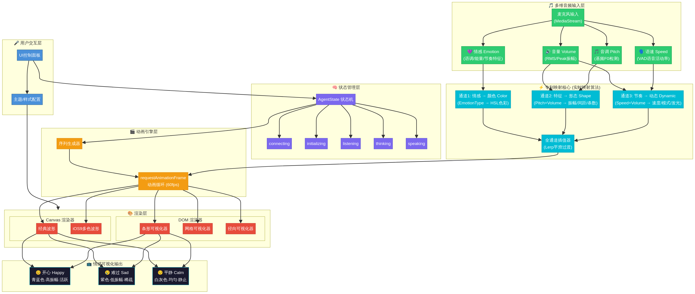

# Abstract Dynamic Waveform（抽象动态波形）

> 一个高性能、零依赖的AI语音交互视觉反馈引擎，融合SiriWave.js的渲染性能与LiveKit Agents UI的状态机设计，并创新性地引入三通道情感映射系统。



---

## 项目简介

Abstract Dynamic Waveform 是一个面向AI语音助手场景的实时音频可视化库。它通过**三段式架构**将语音交互的全过程转化为富有情感表达的动态视觉效果：

1. **多维音频输入** — 实时提取音量、音调、语速、情感四个维度的特征
2. **三通道映射核心** — 情感→颜色、特征→形态、节奏→动态的并行映射
3. **情感可视化输出** — 5种渲染器风格（Bar/Classic/iOS9/Grid/Radial）

### 核心特性

| 特性 | 说明 |
|------|------|
| **零核心依赖** | 仅使用Web标准API（Web Audio API + Canvas/DOM），无第三方运行时依赖 |
| **高性能渲染** | 基于requestAnimationFrame的60fps动画循环，帧率无关插值 |
| **5种AgentState** | connecting → initializing → listening → thinking → speaking 完整状态机 |
| **6种情感预设** | Happy/Sad/Calm/Angry/Excited/Neutral，每种映射到独立的颜色/形态/动态参数 |
| **5种渲染器** | Bar条形、Classic经典波、iOS9多曲线、Grid网格、Radial径向环 |
| **框架无关** | 核心引擎不依赖任何UI框架，可集成到React/Vue/Angular/原生JS |
| **TypeScript优先** | 完整的类型定义，编译时类型安全 |

---

## 快速开始

### 安装

```bash
npm install abstract-dynamic-waveform
```

### 最简用法（5行代码）

```typescript
import { AbstractDynamicWaveform } from 'abstract-dynamic-waveform';

const waveform = new AbstractDynamicWaveform();
waveform.mount(document.getElementById('container')!);

const stream = await navigator.mediaDevices.getUserMedia({ audio: true });
waveform.connectAudio(stream);
```

### 完整配置

```typescript
import { AbstractDynamicWaveform } from 'abstract-dynamic-waveform';

const waveform = new AbstractDynamicWaveform({
  renderer: 'bar',
  initialState: 'connecting',
  initialEmotion: 'neutral',
  audio: {
    fftSize: 256,
    bandCount: 24,
    smoothingTimeConstant: 0.8,
    minDecibels: -90,
    maxDecibels: -10,
  },
  animation: {
    lerpSpeed: 0.12,
    targetFPS: 60,
  },
});

waveform.mount(document.getElementById('container')!);

waveform.on('stateChange', (from, to) => {
  console.log(`状态变更: ${from} → ${to}`);
});

waveform.on('emotionChange', (from, to) => {
  console.log(`情感变更: ${from} → ${to}`);
});

const stream = await navigator.mediaDevices.getUserMedia({ audio: true });
waveform.connectAudio(stream);

// 手动控制状态
waveform.transition('connected');       // → initializing
waveform.transition('initialized');     // → listening
waveform.transition('speech_detected'); // → thinking
waveform.transition('ai_responding');   // → speaking

// 手动设置情感
waveform.setEmotion('happy');

// 切换渲染器
waveform.setRenderer('radial');

// 清理
waveform.disconnectAudio();
waveform.dispose();
```

---

## 架构概览

### 三段式核心架构

```
┌─────────────────┐    ┌──────────────────┐    ┌─────────────────┐
│  多维音频输入     │    │   三通道映射核心    │    │  情感可视化输出   │
│                 │    │                  │    │                 │
│  音量 Volume     │───▶│ 情感 → 颜色 Color │───▶│  Bar 条形        │
│  音调 Pitch      │    │ 特征 → 形态 Shape │    │  Classic 波形    │
│  语速 Speed      │    │ 节奏 → 动态 Dynamic│    │  iOS9 多曲线     │
│  情感 Emotion    │    │                  │    │  Grid 网格       │
│                 │    │                  │    │  Radial 径向     │
└─────────────────┘    └──────────────────┘    └─────────────────┘
```

### 情感预设参数

| 情感 | 色相 | 饱和度 | 振幅范围 | 速度倍率 | 波动模式 |
|------|------|--------|---------|---------|--------|
| Happy | 180° 青蓝 | 90% | 0.8~1.0 | 1.2x | active |
| Sad | 270° 紫色 | 60% | 0.3~0.6 | 0.6x | slow |
| Calm | 0° 白灰 | 10% | 0.1~0.3 | 0.4x | breathing |
| Angry | 0° 红色 | 95% | 0.9~1.0 | 1.5x | shaking |
| Excited | 60° 金黄 | 85% | 0.7~1.0 | 1.8x | pulsing |
| Neutral | 210° 蓝灰 | 30% | 0.2~0.4 | 0.8x | steady |

---

## API参考

### 生命周期方法

| 方法 | 说明 |
|------|------|
| `mount(container: HTMLElement)` | 挂载到DOM容器并启动动画循环 |
| `connectAudio(stream: MediaStream)` | 连接音频流，开始实时分析 |
| `disconnectAudio()` | 断开音频流 |
| `dispose()` | 销毁实例，释放所有资源 |

### 状态方法

| 方法 | 说明 |
|------|------|
| `getState(): AgentState` | 获取当前状态 |
| `transition(event: AgentEvent): boolean` | 触发状态转换事件 |
| `setState(state: AgentState)` | 强制设置状态 |

### 情感方法

| 方法 | 说明 |
|------|------|
| `getEmotion(): EmotionType` | 获取当前情感 |
| `setEmotion(emotion: EmotionType)` | 手动设置情感 |
| `setBlendedEmotion(emotions: Map<EmotionType, number>)` | 设置混合情感 |
| `clearEmotion()` | 清除手动情感，恢复自动检测 |

### 数据访问方法

| 方法 | 说明 |
|------|------|
| `getFrameData(): Readonly<FrameData>` | 获取当前帧数据快照 |
| `getAudioFeatures(): Readonly<AudioFeatures>` | 获取当前音频特征快照 |

### 事件列表

| 事件 | 回调签名 |
|------|--------|
| `stateChange` | `(from: AgentState, to: AgentState) => void` |
| `emotionChange` | `(from: EmotionType, to: EmotionType) => void` |
| `frameUpdate` | `(frame: Readonly<FrameData>) => void` |
| `audioStart` / `audioStop` | `() => void` |
| `rendererChange` | `(from: RendererType, to: RendererType) => void` |
| `error` | `(error: WaveformError) => void` |

---

## 项目结构

```
src/
├── types/           # 类型定义（base/audio/mapping/rendering/events）
├── utils/           # 工具函数（math/hsl/lerp）
├── core/            # 核心模块（config/StateMachine/AnimationLoop）
├── audio/           # 第一段：音频输入（6个提取器）
├── mapping/         # 第二段：映射核心（3通道+插值器）
├── rendering/       # 第三段：渲染输出（5个渲染器+序列生成器）
└── index.ts         # 主入口类
```

---

## 设计文档

| 阶段 | 文档 | 内容 |
|------|------|------|
| 第1阶段 | [REPO_ANALYSIS.md](./REPO_ANALYSIS.md) | SiriWave.js和LiveKit Agents UI深度源代码分析 |
| 第2阶段 | [ARCHITECTURE.md](./ARCHITECTURE.md) | 三段式架构设计（v3），含5张架构图 |
| 第3阶段 | [INTERFACE_DESIGN.md](./INTERFACE_DESIGN.md) | 17个核心类的完整接口定义 |
| 第4阶段 | `src/` | 31个源文件，3,210行TypeScript实现 |
| 第5阶段 | [REQUIREMENTS_REFLECTION.md](./REQUIREMENTS_REFLECTION.md) | 53项需求对比验证，合规率98% |
| 第6阶段 | [TEST_STRATEGY.md](./TEST_STRATEGY.md) | 71+测试用例，覆盖率目标85% |

---

## 技术背景

本项目基于对"实用主义流派"两个代表性开源项目的深度分析：

| 项目 | 特点 | 本项目借鉴 |
|------|------|----------|
| [SiriWave.js](https://github.com/kopiro/siriwave) | 680行代码、零依赖、Canvas高性能渲染 | 渲染算法、动画循环、最小化设计哲学 |
| [LiveKit Agents UI](https://github.com/livekit-examples/agent-starter-react) | 30+组件、完整状态机、多种可视化器 | AgentState模型、序列动画、多频段处理 |

---

## 许可证

MIT License
